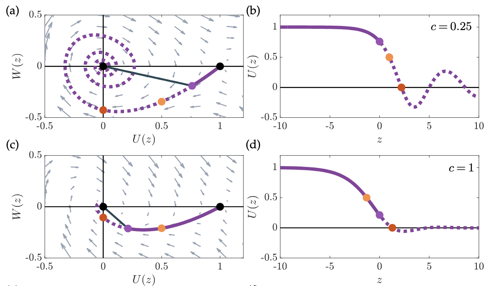
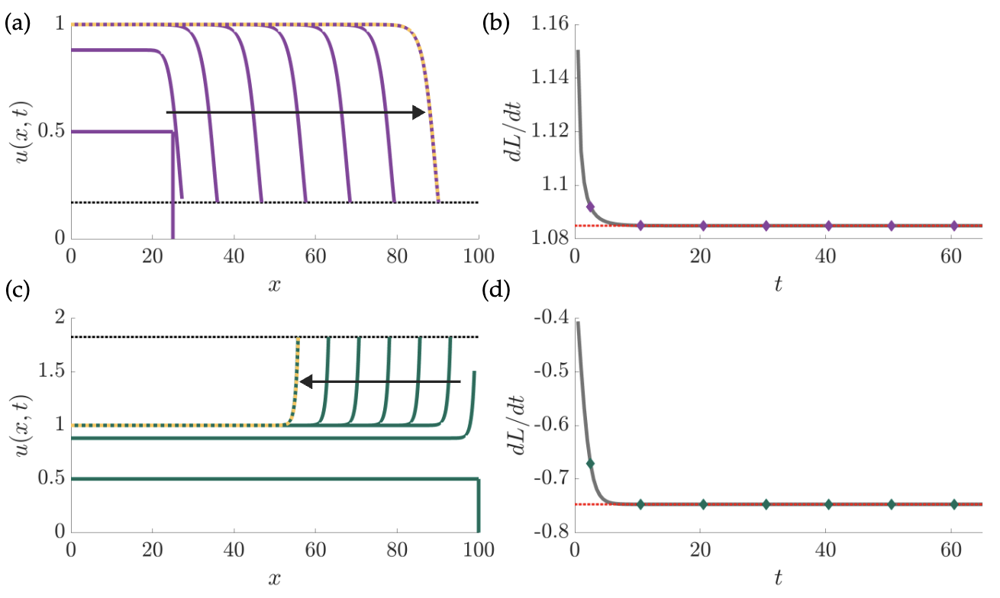

## Invading and receding travelling waves of a model with a mass-conserving, moving boundary
This MATLAB code accompanies the manuscript "Invading and receding travelling waves of a model with a mass-conserving, moving boundary" by Georgia R. Weatherley, Adrianne L. Jenner, and Michael C. Dallaston. 

The main functions are: 
- solve_phase_plane.m
- Find_ustar_func.m
- Solve_PDE_func.m
- load_pert_sols.m
- wave_speed_curve.mat (note that this is also generated by running Figure_3_script.m)

The following scripts reproduce figures from the manuscript (named accordingly). They can be run in MATLAB provided all functions (above) are in your current folder. 
- Figure_2_script.m
- Figure_3_script.m
- Figure_4_script.m
- Figure_5_script.m
- Figure_7_script.m

Below are examples of Figure 2, and Figure 7 from the manuscript:

Please email any enquiries to: georgia.weatherley@hdr.qut.edu.au
